## Laboratory work №5

1. I studied Linux file systems, their structures, names and content of their directories.
2. I learned how to use commands for working with files and directories, how to manage processes and how to check disk usage.

## Report about laboratory work №5 in Russian

0. Создала каталог lab5, в него скопировала шаблоны отчёта и презентации.(рис.1)

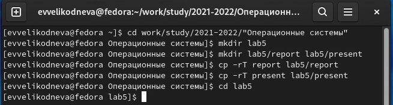{ #fig:001 width=70% }

1. В первой части описания лабораторной работы были приведены следующие команды:

1.1. touch - создаёт новый файл. Я создала файл lab5.txt, в него записала числа от 1 до 40, чтобы при выполнении следующих команд они выводились на экран.(рис.2, 3)

1.2. cat - даёт возможность просматривать файлы небольшого размера. Я вывела на экран содержимое файла, созданного прошлой командой.(рис.2)

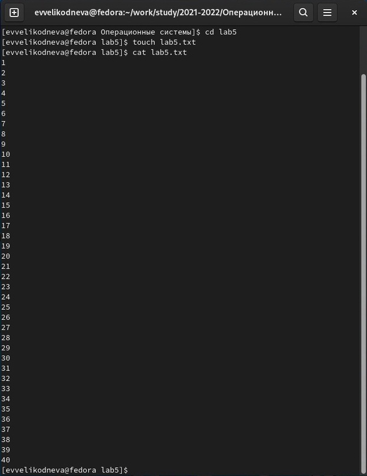{ #fig:001 width=70% }

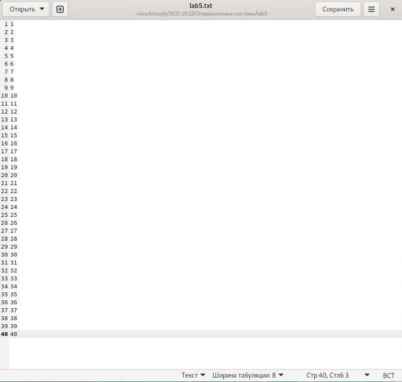{ #fig:001 width=70% }

1.3. less - используется для просмотра файлов постранично. Я посмотрела содержимое созданного мной в первом пункте файла.(рис.5,6)

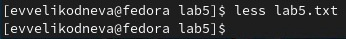{ #fig:001 width=70% }

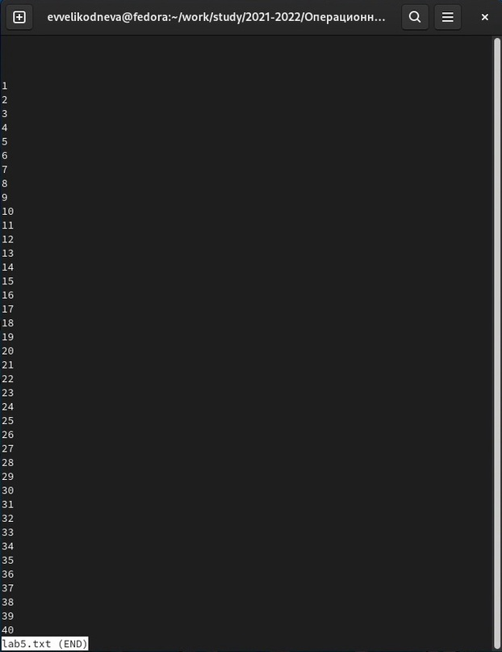{ #fig:001 width=70% }

1.4. head - по умолчанию выводит первые 10 строк файла на экран, с помощью опции -n можно задать количество выводимых строк. Вывела 15 первых строк файла lab5.txt.(рис.6)

{ #fig:001 width=70% }

1.5. tail - по умолчанию выводит последние 10 строк файла. С помощью опции -n можно задать количество выводимых строк. Вывела 15 последних строк файла lab5.txt.(рис.7)

{ #fig:001 width=70% }

2. 
2.1. С помощью команды cp скопировала файл /usr/include/sys/io.h в домашний каталог и назвала его
equipment.(рис.8)

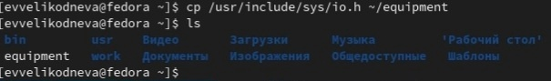{ #fig:001 width=70% }

2.2. С помощью команды mkdir в домашнем каталоге создала директорию ~/ski.plases. Проверила её создание с помощью команды ls(вывод содержимого каталога)(рис.9)

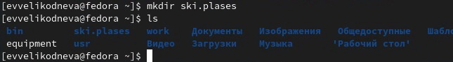{ #fig:001 width=70% }

2.3. С помощью команды mv переместила файл equipment в каталог ~/ski.plases. Проверила нахождение файла в каталоге ~/ski.plases.(рис.10)

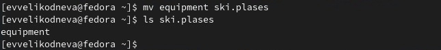{ #fig:001 width=70% }

2.4. С помощью команды cp переименовала файл ~/ski.plases/equipment в ~/ski.plases/equiplist. Проверила изменение его имени.(рис.11)

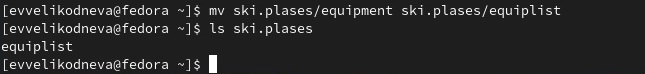{ #fig:001 width=70% }

2.5. С помощью команды touch создала в домашнем каталоге файл abc1. С помощью команды cp скопировала его в каталог ~/ski.plases, задав новое имя equiplist2. Выполнила проверку каждого действия командой ls.(рис.12)

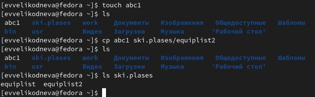{ #fig:001 width=70% }

2.6. С помощью команды mkdir создала каталог с именем equipment в каталоге ~/ski.plases. Проверка его нахождения в каталоге.(рис.13)

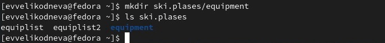{ #fig:001 width=70% }

2.7. С помощью команды mv переместила файлы ~/ski.plases/equiplist и equiplist2 в каталог
~/ski.plases/equipment. Проверила их отсутствие в каталоге ~/ski.plases и наличие в каталоге ~/ski.plases/equipment.(рис.14)

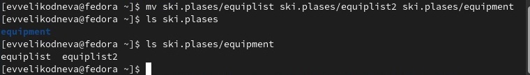{ #fig:001 width=70% }

2.8. С помощью команды mkdir создала каталог с именем ~/newdir и с помощью команды cp переместила в каталог ~/ski.plases с новым именем plans. Проверила выполнение обеих команд.(рис.15)

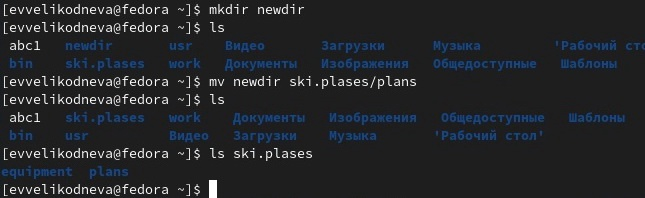{ #fig:001 width=70% }

3. 
3.1. Создала новую директорию с именем australia. Используя команду chmod и восьмеричную форму записи передала каталогу следующие права: drwxr--r--(744)(рис.16). Проверила добавление данных прав с помощью команды ls -l(выводит список файлов и подкаталогов в каталоге и предоставляет дополнительную информацию о них).(рис.17)

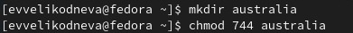{ #fig:001 width=70% }

{ #fig:001 width=70% }

3.2. Создала новую директорию с именем play. Используя команду chmod и восьмеричную форму записи передала каталогу следующие права: drwx--x--x(711)(рис.18). Проверила добавление данных прав с помощью команды ls -l.(рис.19)

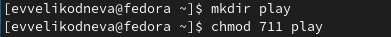{ #fig:001 width=70% }

{ #fig:001 width=70% }

3.3. Создала новый файл с именем my_os. С помощью команды chmod, используя восьмеричную форму записи,  передала файлу следующие права: -r-xr--r--(544)(рис.20). Проверила добавление данных прав с помощью команды ls -l.(рис.21)

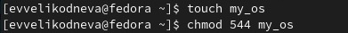{ #fig:001 width=70% }

{ #fig:001 width=70% }

3.4. Создала новый файл с именем feathers. С помощью команды chmod, используя восьмеричную форму записи,  передала файлу следующие права: -rw-rw-r--(644)(рис.22). Проверила добавление данных прав с помощью команды ls -l.(рис.23)

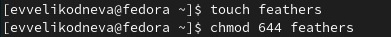{ #fig:001 width=70% }

{ #fig:001 width=70% }

4. 

4.1. С помощью команды cat посмотрела содержимое файла /etc/passwd.(рис.24-25)

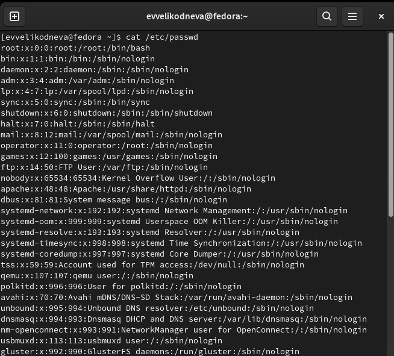{ #fig:001 width=70% }

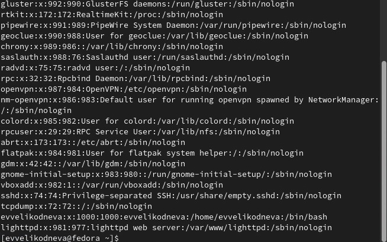{ #fig:001 width=70% }

4.2. С помощью команды cp скопировала файл ~/feathers в файл ~/file.old.(рис.26)

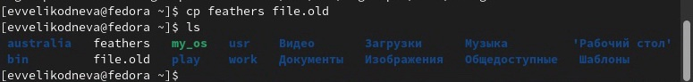{ #fig:001 width=70% }

4.3. Используя команду mv переместила файл ~/file.old в каталог ~/play.(рис.27)

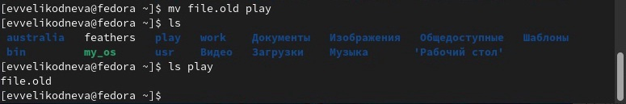{ #fig:001 width=70% }

4.4. С помощью команды cp скопировала каталог ~/play в каталог ~/fun.  Опция -r обозначает рекурсивное копирование, то есть полное копирование каталога. Выполнила проверку появления нового каталога командой ls.(рис.28)

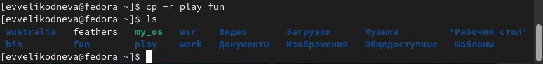{ #fig:001 width=70% }

4.5. Используя команду mv переместила каталог ~/fun в каталог ~/play и сразу дала ему новое имя games. Выполнила проверку его отсутствия в домашнем каталоге и присутствия в каталоге ~/play командой ls.(рис.29)

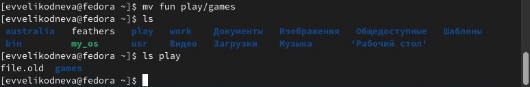{ #fig:001 width=70% }

4.6. С помощью команды chmod u-r(u - владелец, - - отнятие прав, r - чтение) лишила владельца файла ~/feathers права на чтение.(рис.30)

{ #fig:001 width=70% }

4.7. Попыталась посмотреть файл ~/feathers командой cat, было отказано в доступе, так как я являюсь владельцем файла, а права на чтение у владельца нет.(рис.31)

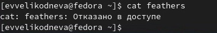{ #fig:001 width=70% }

4.8. Попыталась скопировать файл ~/feathers командой cp. Копирование не было выполнено.(рис.32)

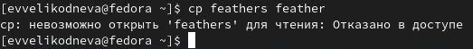{ #fig:001 width=70% }

4.9. Используя команду chmod u+r вернула владельцу файла ~/feathers право на чтение.(рис.33)

{ #fig:001 width=70% }

4.10. С помощью команды chmod u-x лишила владельца каталога ~/play права на выполнение.(рис.34)

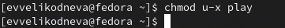{ #fig:001 width=70% }

4.11. Попыталась перейти в каталог ~/play с помощью команды cd. Получила отказ в доступе.(рис.35)

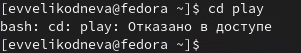{ #fig:001 width=70% }

4.12. С помощью команды chmod u+x вернула владельцу каталога ~/play право на выполнение.(рис.36)

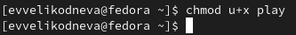{ #fig:001 width=70% }

5. Прочитала man по командам:
5.1.mount.(рис.37-38) Команда sudo mount показывает список примонтированных устройств, а mount с разными опциями может подключить или примонтировать сетевой диск, раздел жесткого диска или USB-накопитель. 

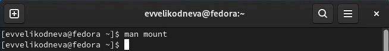{ #fig:001 width=70% }

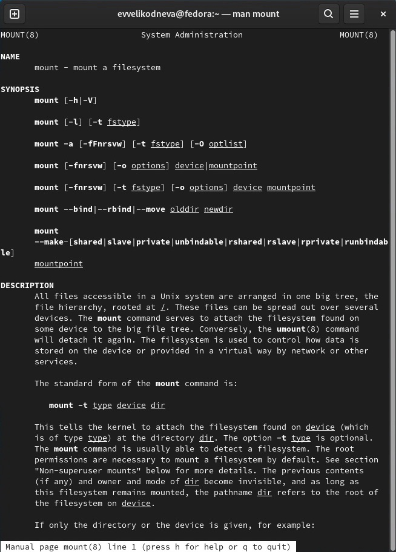{ #fig:001 width=70% }

5.2.fsck(рис.39-40) Команда fsck выполняет проверки согласованности и интерактивное восстановление в файловых системах Linux. Её можно использовать для восстановления поврежденных файловых систем в ситуациях, когда система не загружается. 

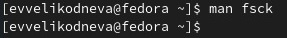{ #fig:001 width=70% }

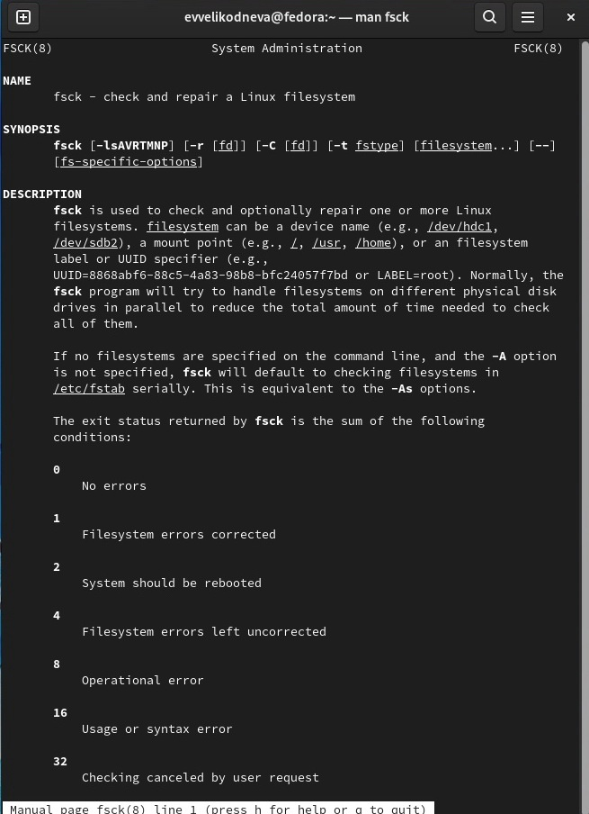{ #fig:001 width=70% }

5.3.mkfs(рис.41-42) Команда mkfs создаёт новую файловую систему, но с её помощью можно также проверить тип файловой системы устройства. 

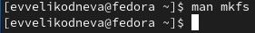{ #fig:001 width=70% }

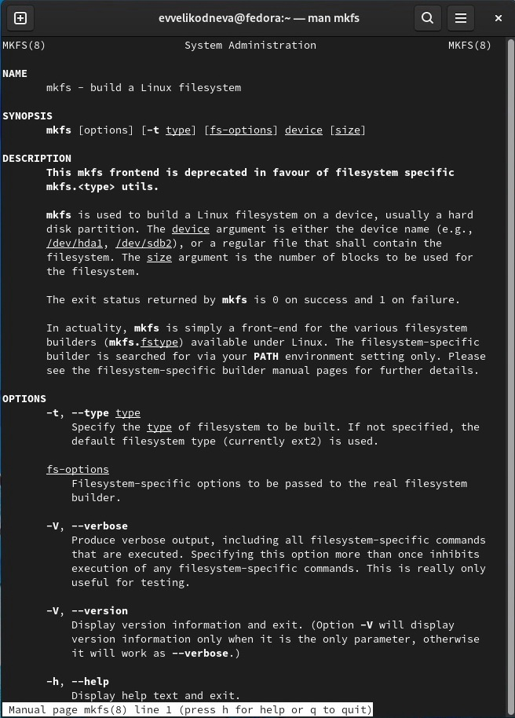{ #fig:001 width=70% }

5.4.kill(рис.43-44) Команда kill используется для принудительного завершения работы каких-либо процессов, с её помощью также можно получить список поддерживаемых системных сигналов и продолжить исполнение процесса.

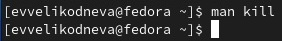{ #fig:001 width=70% }

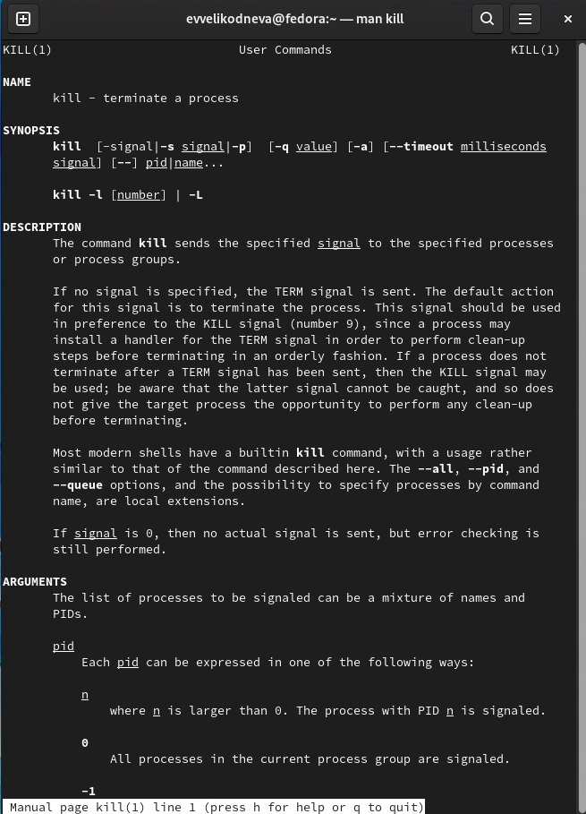{ #fig:001 width=70% }
