# Теоретическое введение

Midnight Commander (или mc) — псевдографическая командная оболочка для UNIX/Linux
систем.

Над панелями располагается меню, доступ к которому осуществляется с помощью
клавиши F9 . Под панелями внизу расположены управляющие экранные кнопки, ассоци-
ированные с функциональными клавишами F1 – F10. Над ними располагается
командная строка, предназначенная для ввода команд.

Панель в mc отображает список файлов текущего каталога. Абсолютный путь к этому
каталогу отображается в заголовке панели. У активной панели заголовок и одна из её
строк подсвечиваются. Управление панелями осуществляется с помощью определённых
комбинаций клавиш или пунктов меню mc.

Перейти в строку меню панелей mc можно с помощью функциональной клавиши F9 .
В строке меню имеются пять меню: Левая панель , Файл , Команда , Настройки и Правая панель.

# Выполнение лабораторной работы

1. Изучила информацию о Midnight Commander, вызвав man mc в командной строке.

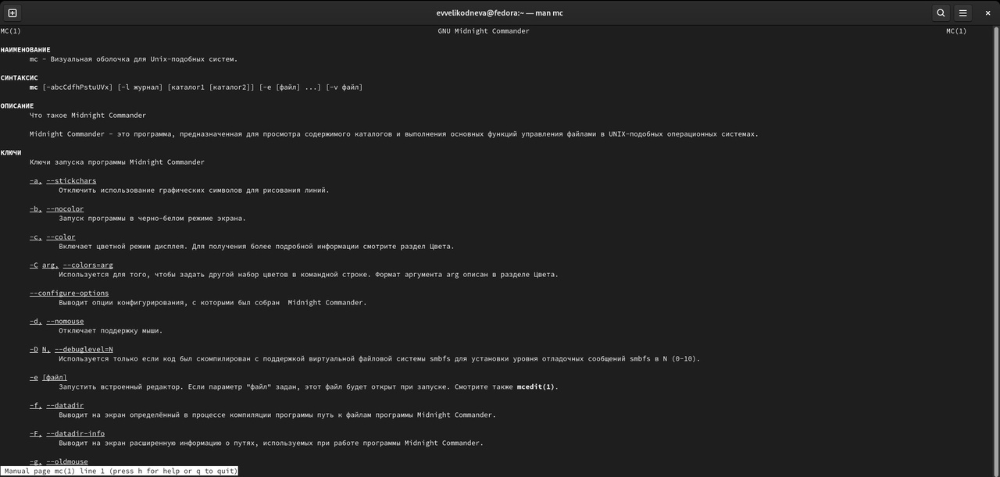

2. Запустила из командной строки mc, изучила его структуру и меню.

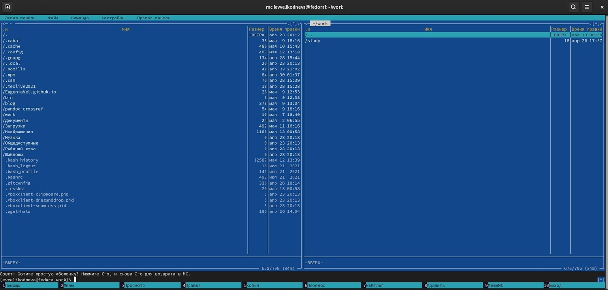

3. 
а)С помощью комбинации клавиш ctrl-u поменяла местами панели в mc.

б)С помощью комбинации клавиш shift и стрелок вверх-вниз выделила каталог ~/work/study в правой панели, затем с помощью той же комбинации отменила выделение каталога.

в)С помощью клавиши f5 скопировала файл Student.cpp из каталога ~/work/study/2021-2022/Операционные системы в каталог ~/work.

г)С помощью клавиши f6 переместила файл Student.cpp из каталога ~/work в домашний каталог.

д)С помощью комбинации клавиш shift и space посмотрела размер домашнего каталога.

4. Выполнила команды:

а)Быстрый просмотр. С её помощью вывела на левую панель содержание файла Student.cpp из домашнего каталога.

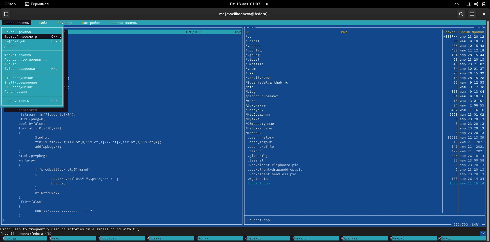

б)Информация. С её помощью вывела на экран информацию об одном из снимков экрана.

в)Дерево каталогов. С её помощью посмотрела содержание домашнего каталога в виде дерева каталогов.

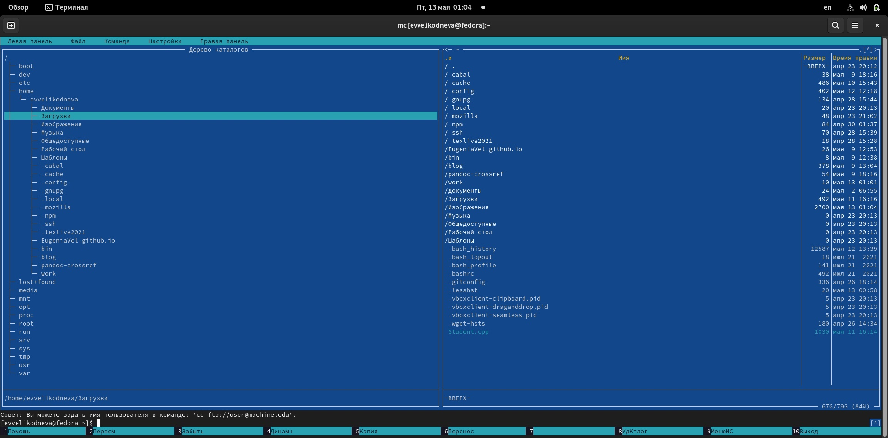

г)Формат списка. С её помощью я изменила формат выводимого списка файлов и каталогов на укороченный.

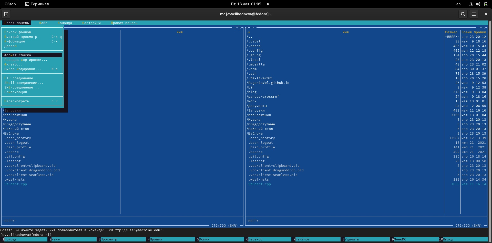

д)Порядок сортировки. С её помощью изменила порядок сортировки файлов и каталогов в домашнем каталоге.

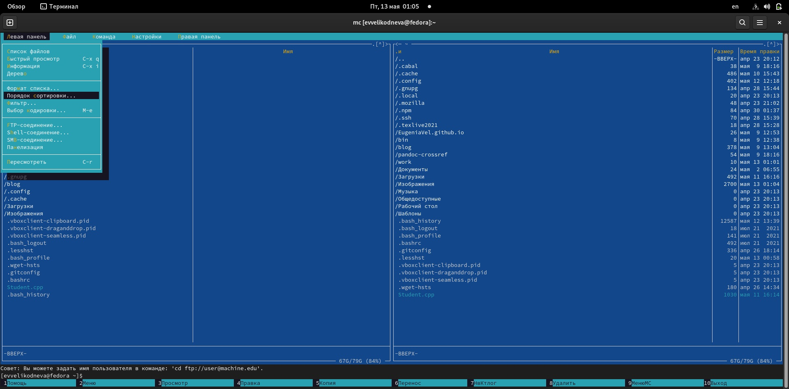

е)Фильтр. С её помощью вывела на экран файлы из домашнего каталога только с расширением .cpp.

5. Используя возможности подменю файл, выполнила следующие операции:
 
-Посмотрела содержимое файла Student.cpp c помощью команды просмотр файла.

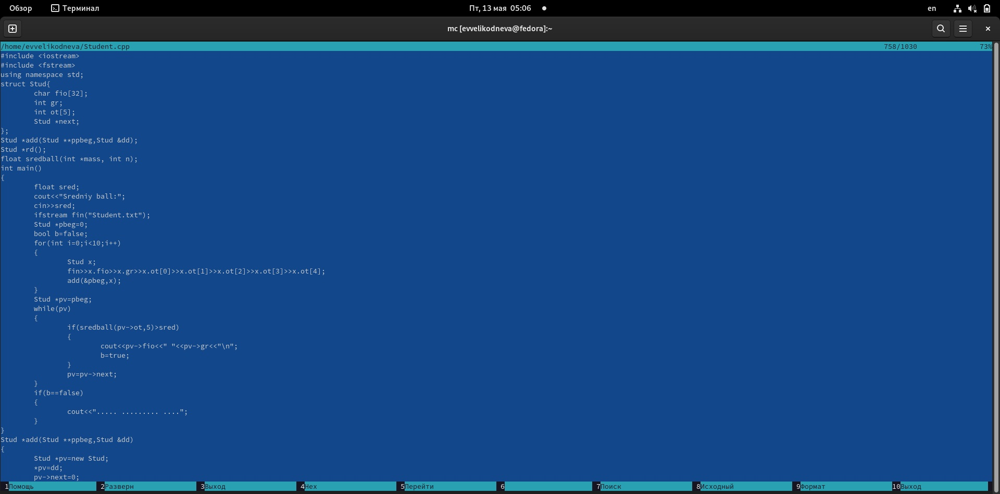

-Отредактировала файл Student.cpp с помощью команды правка, не сохранив изменения.

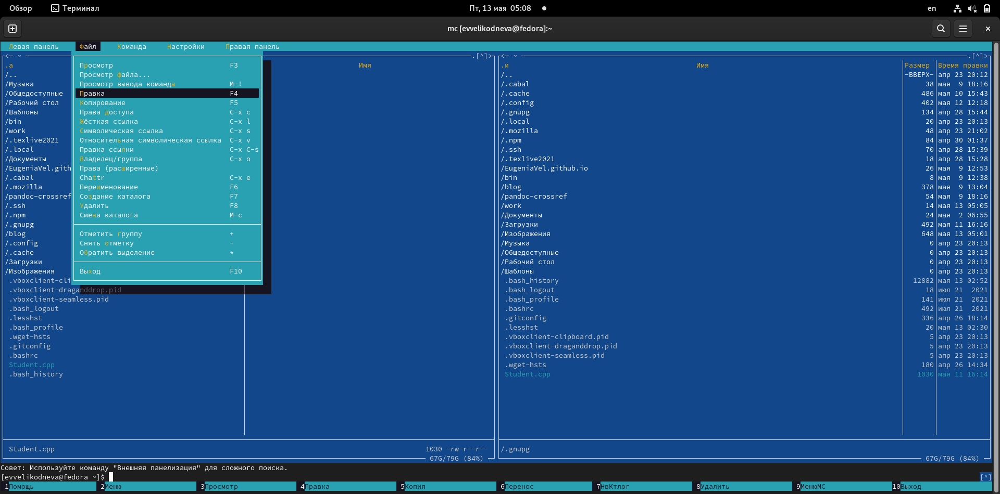

-С помощью команды создание каталога создала каталог ~/lab7.

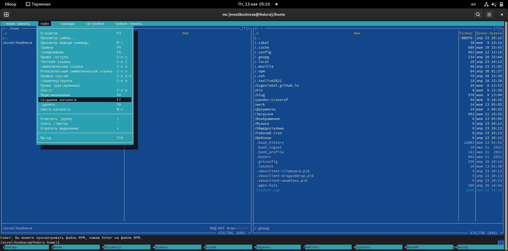

-С помощью команды копирование скопировала два выделенных мной снимка экрана в созданный мной в прошлом пункте каталог ~/lab7. 

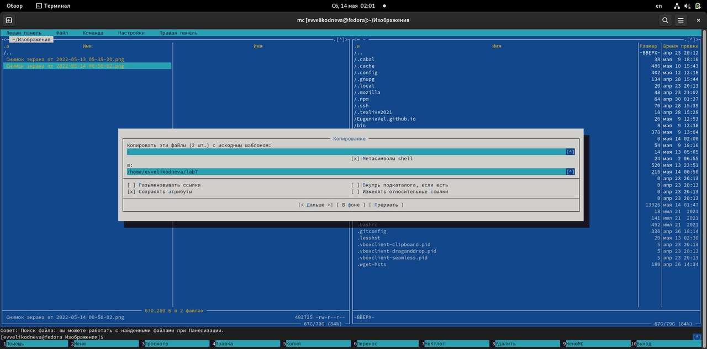

6. Используя возможности подменю команда, выполнила следующие операции: 

-С помощью команды поиск файла в домашнем каталоге рекурсивно нашла все файлы с расширением .txt.

-С помощью команды история, посмотрела историю команд, однако не получила вывод ни одной команды, поэтому не смогла выполнить задание до конца.

-С помощью команды каталоги быстрого доступа, куда я предварительно добавила домашний каталог, переместилась в него.

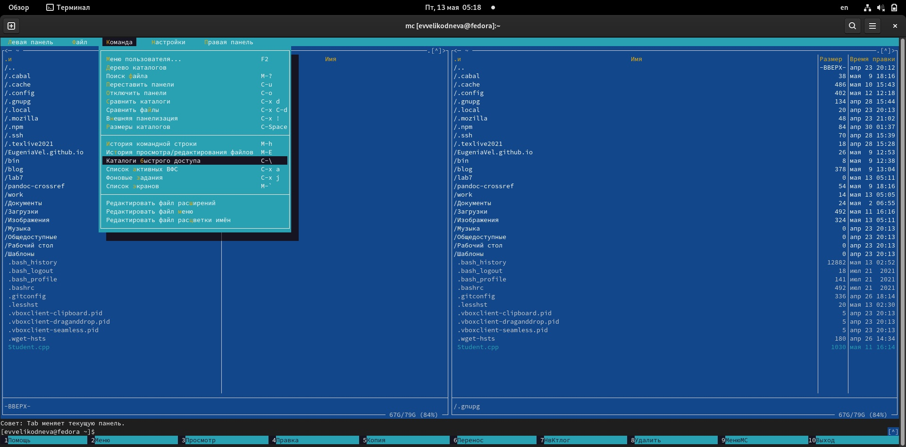

-С помощью команды редактировать файл меню посмотрела содержимое файла меню. Команда позволяет отредактировать контекстное меню пользователя, вызываемое по клавише F2. С помощью команды редактировать файл расширений посмотрела содержимое файла расширений. Команда позволяет позволяет задать с помощью определённого синтаксиса действия при запуске файлов с определённым расширением.

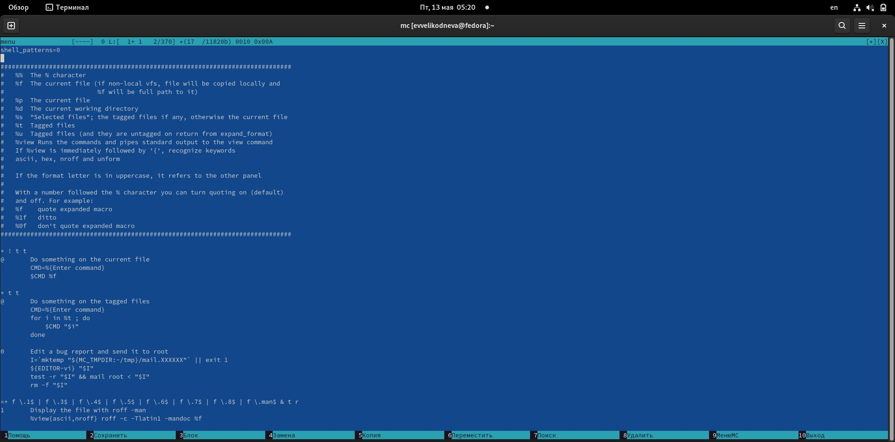

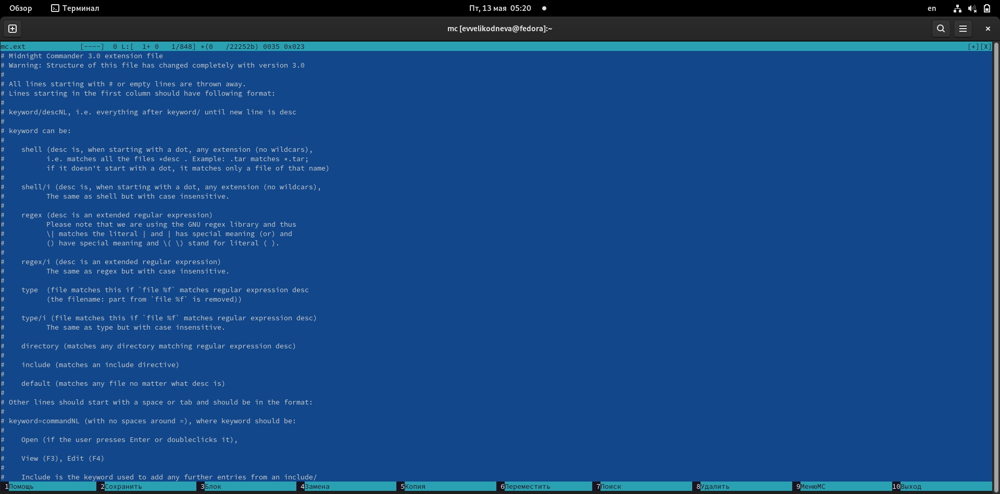

7. Вызвала подменю настройки. В настройках панели нашла команду показывать скрытые файлы. и другие команды, определяющие структуру экрана mc.(Например, изменение темы mc)

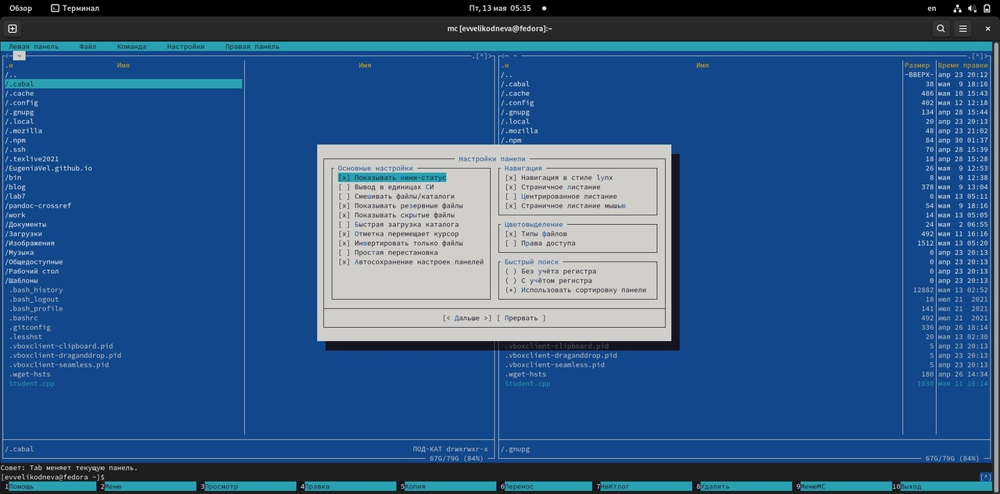

# Задание по встроенному редактору mc

1. С помощью команды touch создала файл text.txt в домашнем каталоге.

2. Открыла файл в редакторе с помощью команды mc -e(можно также использовать команду mcedit).

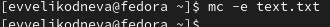

3. Вставила в файл текст шаблона по лабораторной работе.

4. 

4.1. С помощью комбинации клавиш ctrl-y удалила первую строку в тексте файла.

4.2. С помощью клавиши f3 выделила фрагмент текста файла (один абзац) и с помощью клавиши f5 скопировала его на первую строку.

4.3. С помощью клавиши f3 выделила фрагмент текста файла (один абзац) и с помощью клавиши f6 переместила его на следующей строке после второго абзаца.

4.4. С помощью клавиши f2 сохранила изменения в файле.

4.5. С помощью комбинации клавиш ctrl-u отменила перемещение абзаца, сделанное в подпункте 4.3.

4.6. С помощью комбинации клавиш ctrl-end перешла в конец файла и ввела своё ФИО.

4.7. С помощью комбинации клавиш ctrl-home перешла в начало файла и ввела название своей группы.

4.8. Сохранила файл с помощью клавиши f2 и закрыла файл с помощью клавиши f10. 

5. Открыла файл Student.cpp на языке С++.

6. Используя меню редактора(подменю команда), выключила подсветку синтаксиса, так как она изначально была включена.

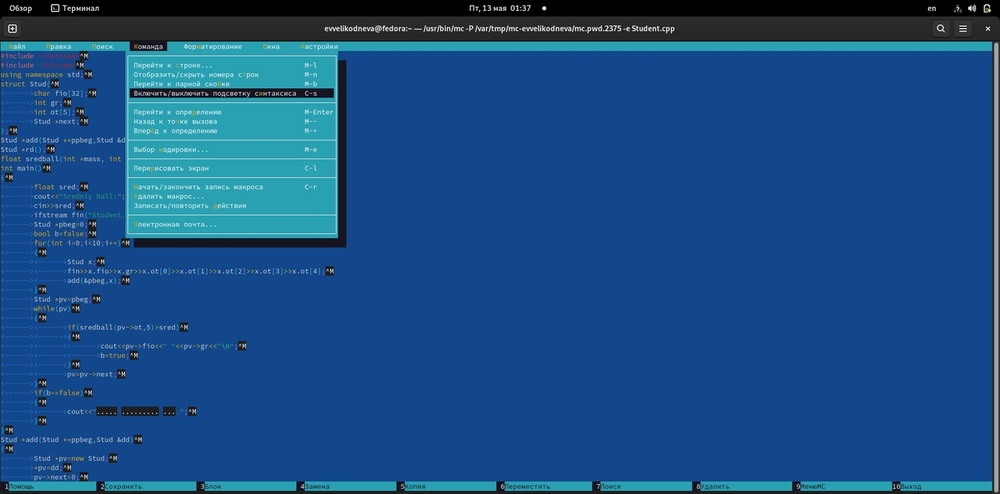

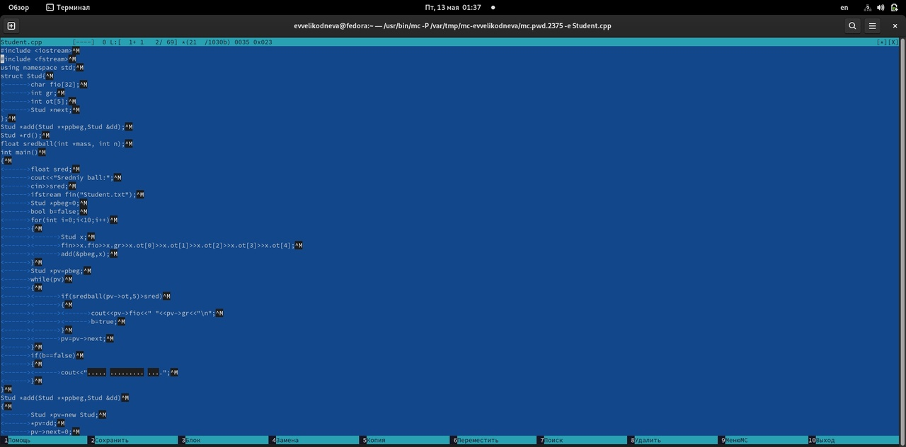
