# Цель работы

Приобретение практических навыков взаимодействия пользователя с системой посредством командной строки.

# Выполнение лабораторной работы

1. С помощью команды cd перешла в домашний каталог. С помощью команды pwd узнала полное имя каталога, в котором нахожусь.

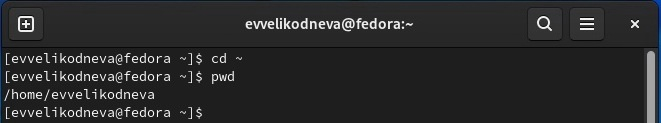

2.1. С помощью команды cd перешла в каталог /tmp.

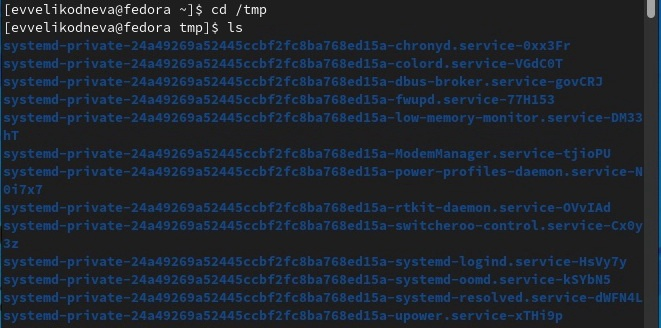

2.2 С помощью команды ls без опций вывела на экран содержимое каталога /tmp. Опция -a позволяет посмотреть абсолютно всё содержимое каталога, даже скрытые файлы. Опция -l позволяет вывести на экран подробную информацию о файлах и каталогах. Опция -F выводит на экран указатель того, как запускается файл или каталог. Соответственно, при использовании всех трёх опций сразу можно увидеть все каталоги и файлы с подробной информацией о них и укзанным типом файла. 

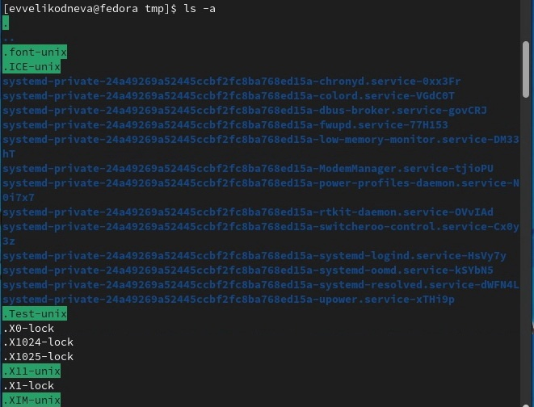

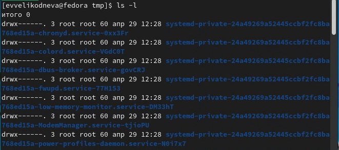

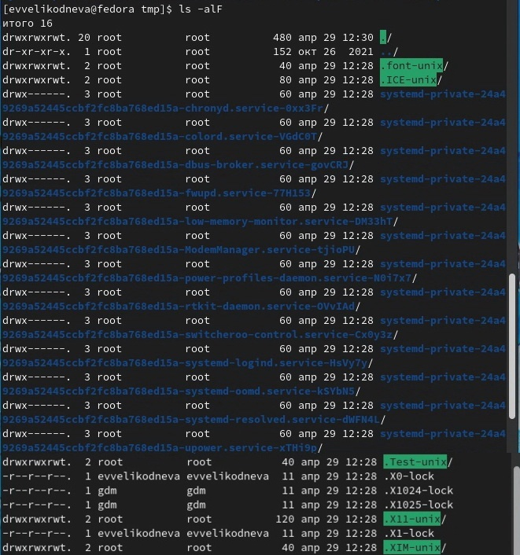

2.3 С помощью команды cd перешла в каталог /var/spool, посмотрела его содержимое с помощью ls и среди каталогов не нашла подкаталог cron.

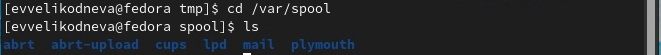

2.4 С помощью команды cd перешла в домашний каталог, с помощью команды ls без опций посмотрела содержимое домашнего каталога и с помощью опции -l посмотрела, кто является владельцем файлов и подкаталогов(evvelikodneva)

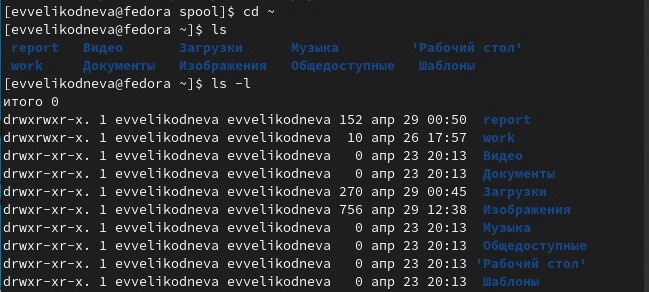

3.1. С помощью команды mkdir создала в домашнем каталоге подкаталог newdir.

3.2. Перешла в каталог newdir и в нём с помощью команды mkdir создала подкаталог morefun.

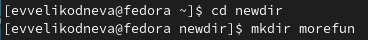

3.3. С помощью команды cd ~ перешла в домашний каталог. В нём с помощью команды mkdir создала сразу три каталога letters, memos и misk. Проверила их создание с помощью команды ls.
Затем с помощью команды rm -r удалила сразу три каталога (letters, memos и misk) и проверила их удаление с помощью команды ls. 

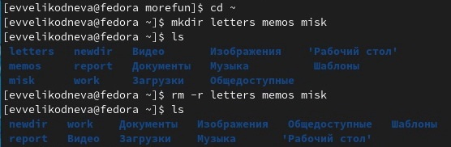

3.4. Попробовала удалить каталог newdir с помощью команды rmdir, однако сделать это не удалось, так как каталог не был пустым.

3.5. Удалила каталог ~/newdir/morefun, проверила его удаление с помощью команды ls. Каталог morefun был успешно удалён из каталога newdir.

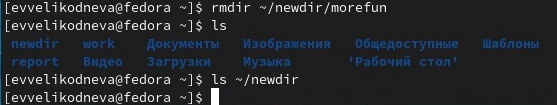

4. С помощью команды man ls посмотрела список опций и их описание, затем нашла опцию -R, которая выводит содержимое не только указанного каталога, но и его подкаталогов. Проверила, как эта опция работает.

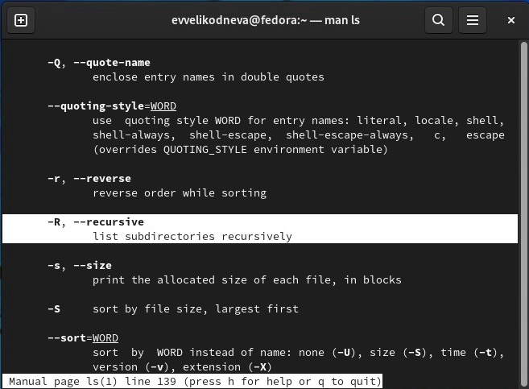

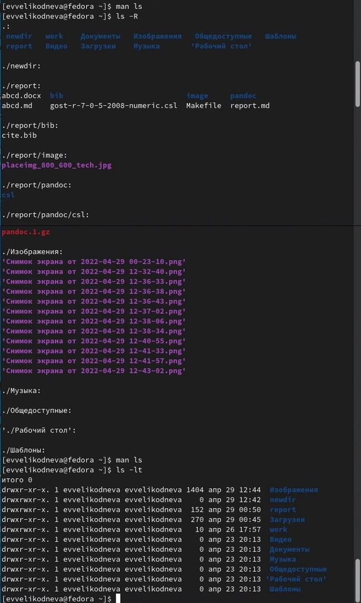

5. С помощью команды man ls посмотрела список опций и их описание, затем нашла опцию -t, которая сортирует выводимый список по времени последнего изменения, и опцию -l, которая выводит развёрнутое описание файлов. (рис.15-16) Проверила, как эти опции работают.

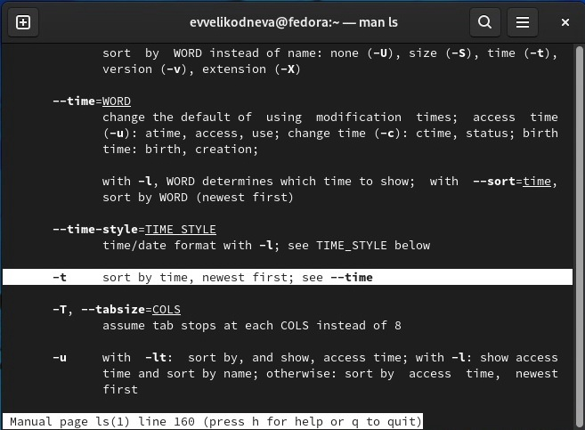

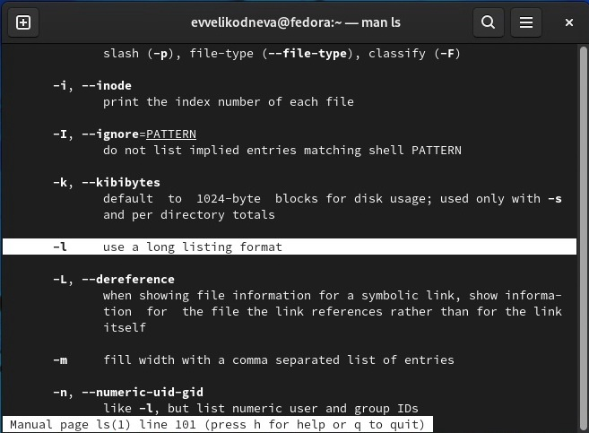

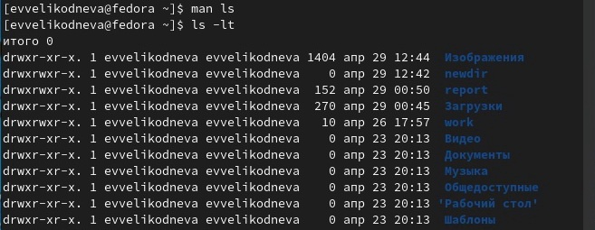

6. Использовала команду man для просмотра списка опций следующих команд:

cd

-P - позволяет следовать по символическим ссылкам перед тем, как будут обработаны все переходы "..";

-L - переходит по символическим ссылкам только после того, как были обработаны "..";

-e - если папку, в которую нужно перейти не удалось найти - выдает ошибку.

pwd

-L, --logical - брать директорию из переменной окружения, даже если она содержит символические ссылки;

-P - отбрасывать все символические ссылки

mkdir

-m (--mode=режим) - назначить режим доступа (права). По умолчанию mod принимает значение 0777, что обеспечивает неограниченные права.

-p (--parents) - не показывать ошибки, а также их игнорировать.

-z  (--context=CTX ) принимает контекст SELinux для каталога по умолчанию.

-v (--verbose) - выводить сообщение о каждом новым каталоге.

rmdir

-p	Позволяет удалить каталог и вышележащие каталоги, оказавшиеся пустыми. На стандартный вывод выдается сообщение об удалении всех указанных в маршруте каталогов или о сохранении части из них по каким-либо причинам.

-s	Подавление сообщения, выдаваемого при действии опции -p.

rm

-f	Команда не выдает сообщений, когда удаляемый файл не существует, не запрашивает подтверждения при удалении файлов, на запись в которые нет прав. Если нет права и на запись в каталог, файлы не удаляются. Сообщение об ошибке выдается лишь при попытке удалить каталог, на запись в который нет прав (см. опцию -r).

-r	Происходит рекурсивное удаление всех каталогов и подкаталогов, перечисленных в списке аргументов. Сначала каталоги опустошаются, затем удаляются. Подтверждение при удалении файлов, на запись в которые нет прав, не запрашивается, если задана опция -f или стандартный ввод не назначен на терминал и не задана опция -i. При удалении непустых каталогов команда rm -r предпочтительнее команды rmdir, так как последняя способна удалить только пустой каталог. Но команда rm -r может доставить немало острых впечатлений при ошибочном указании каталога!

-i	Перед удалением каждого файла запрашивается подтверждение. Опция -i устраняет действие опции -f; она действует даже тогда, когда стандартный ввод не назначен на терминал.

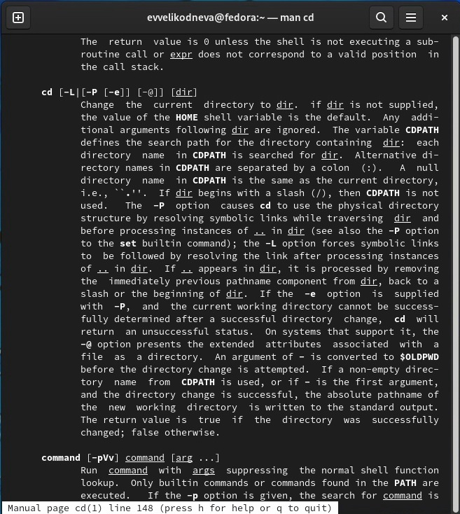

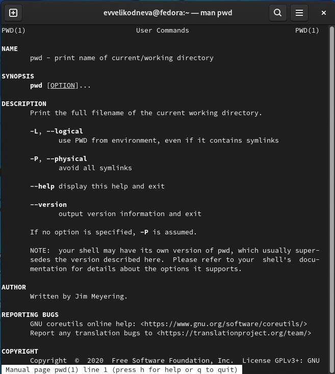

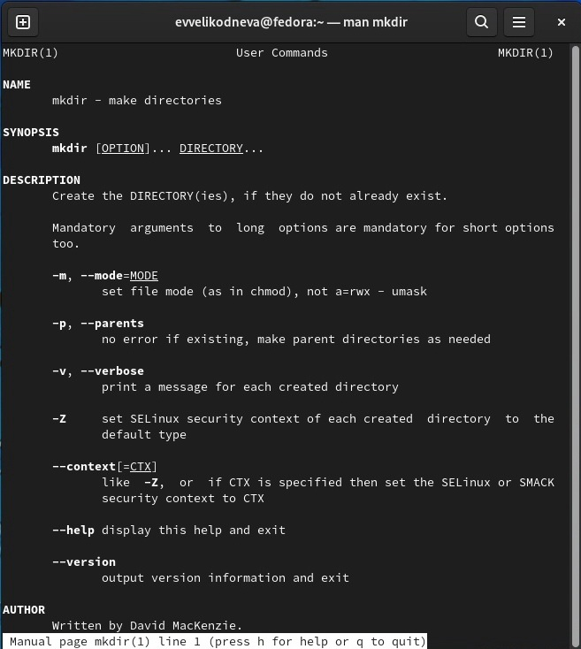

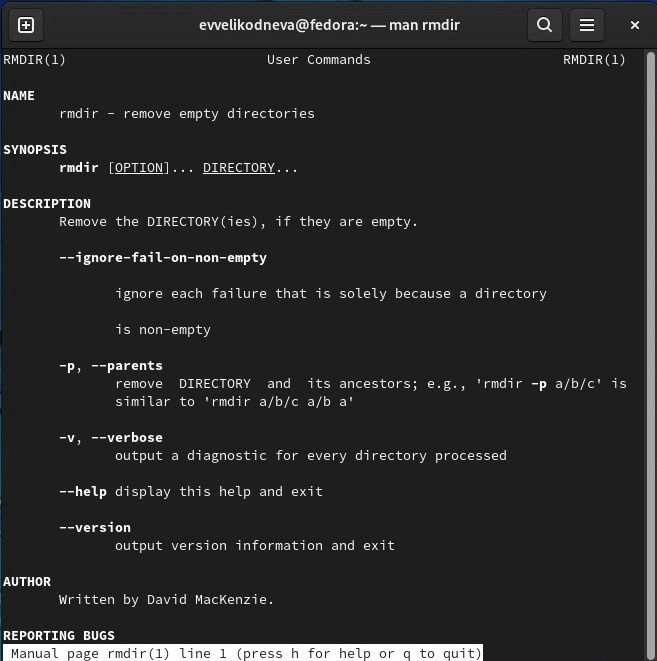

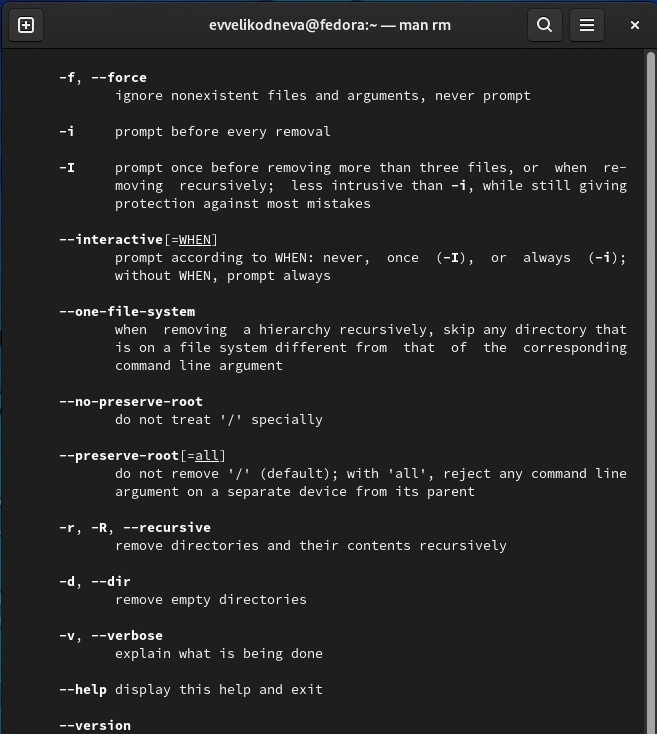

7. С помощью команды history посмотрела историю выполнения команд. Выполнила следующие команды с изменениями:

mkdir(добавила -v(опция, которая выводит описание проделанных команд))

rm -r(добавила -v)

rmdir(добавила -p(опция, которая позволяет удалять каталоги с их содержимым) и -v)

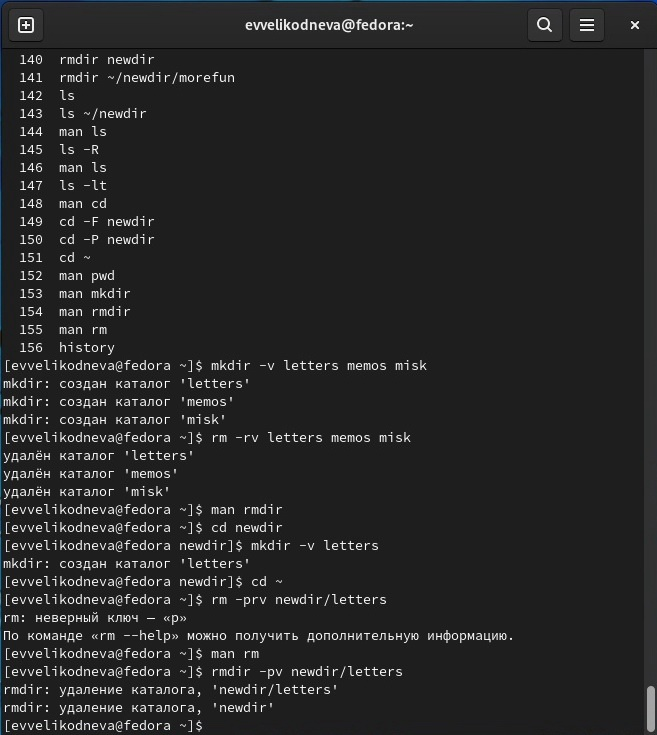
