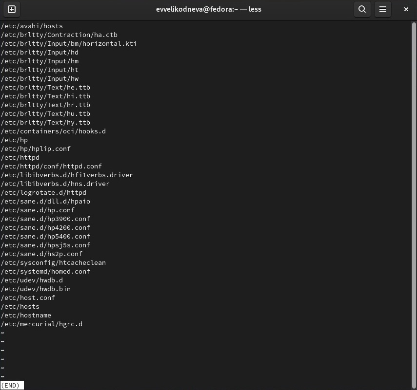

# Выполнение лабораторной работы

1. С помощью команды login зашла в систему, используя соответствующее имя пользователя.

2. С помощью команд ls и grep и их опций, а также потока вывода (>,>>) записала в файл file.txt названия файлов, содержащихся в каталоге /etc и затем дописала в этот же файл названия файлов,содержащихся в домашнем каталоге.

3. Используя команд cat и grep, сначала вывела на экран имена всех файлов из file.txt, имеющих расширение .conf, а затем с помощью потока вывода записала их в новый текстовый файл с именем conf.txt.

4. С помощью команды find и её опций нашла все файлы, начинающиеся с символа c, которые содержатся в домашнем каталоге.

5. С помощью команд find, less, их опций и конвейера постранично вывела на экран имена файлов из каталога /etc,начинающихся с символа h.(рис.6-7)

6. Используя команду find, потоковый вывод и &, запустила в фоновом режиме процесс, который записывает в файл ~/logfile файлы,имена которых начинаются с log.

7. С помощью команды rm удалила файл ~/logfile.

8. С помощью знака & запустила из консоли в фоновом режиме редактор gedit.

9. Используя команду ps aux, фильтр grep и конвейер, определила идентификатор процесса gedit. Кроме того, идентификатор процесса указан при его запуске в фоновом режиме.

10. Прочитала справку (man) команды kill. Использовала команду kill % с PID для завершения процесса gedit.

11. Команда df показывает размер каждого смонтированного раздела диска. Команда du показывает число килобайт,используемое каждым файлом или каталогом.

12. С помощью команды find и её опций maxdepth и type вывела имена всех директорий,имею-
щихся в домашнем каталоге.

# Выводы

Ознакомилась с инструментами поиска файлов и фильтрации текстовых данных.
Приобрела практические навыки: по управлению процессами (и заданиями), по
проверке использования диска и обслуживанию файловых систем.
