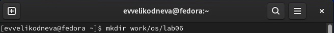
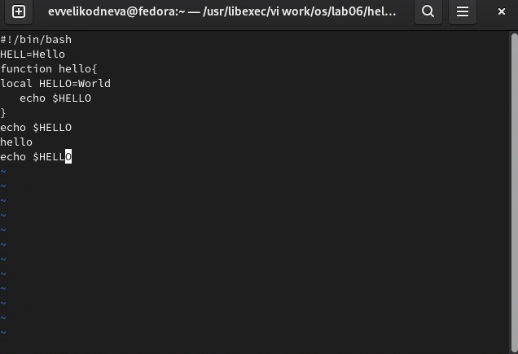

# Цель работы

Познакомиться с операционной системой Linux. Получить практические навыки работы с редактором vi, установленным по умолчанию практически во всех дистрибутивах.

# Выполнение лабораторной работы

# Задание 1

1. С помощью команды mkdir создала каталог ~/work/os/lab06.(рис.1)

2. С помощью команды cd перешла в созданный в первом пункте каталог.(рис.2)

3. Вызвала vi и создала новый файл hello.sh.(рис.3-4)

4. Нажала клавишу i, чтобы перейти в режим ввода(INSERT) и ввела предложенный в задании текст.(рис.5)

5. Нажала клавишу esc для перехода в командный режим. Внизу теперь нет слова INSERT.(рис.6)

6. Нажала двоеточие для перехода в режим последней строки. Внизу появилось приглашение в виде двоеточия.(рис.7)

7. Ввела wq для сохранения файла и завершения работы.(рис.8)

8. С помощью команды chmod сделала файл исполняемым(добавила право на исполнение файла).(рис.9)

# Задание 2

1. Вызвала vi для редактирования файла hello.sh.(рис.10)

2. Установила курсор в конце слова HELL во второй строке.(рис.11)

3. Нажав на клавишу i, перешла в режим вставки и заменила слово HELL на HELLO. Нажала клавишу esc для перехода в командный режим.(рис.12)

4. Установила курсор на 4 строку(рис.13) Нажав на клавиши dw, удалила слово LOCAL.(рис.14)

5. Нажав на букву i, перешла в режим вставки и набрала слово local.(рис.15) Нажала клавишу esc для перехода в командный режим.

6. Установила курсор на последней строке.(рис.16) После неё вставила строчку "echo $HELLO".(рис.17)

7. Нажала клавишу esc для перехода в командный режим.

8. Нажав на клавишу d дважды, удалила последнюю строку.(рис.18)

9. Нажала на клавишу u для отмены изменений.(рис.19)

10. Ввела символ : для перехода в режим последней строки, затем ввела w для сохранения изменений и q для выхода из vi.

# Выводы

Познакомилась с операционной системой Linux. Получила практические навыки работы с редактором vi, установленным по умолчанию практически во всех дистрибутивах.
